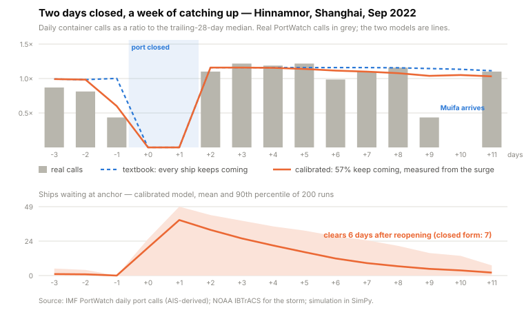
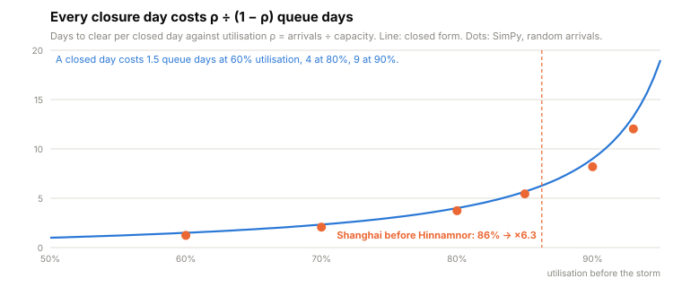
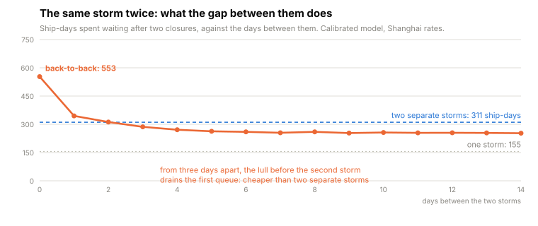
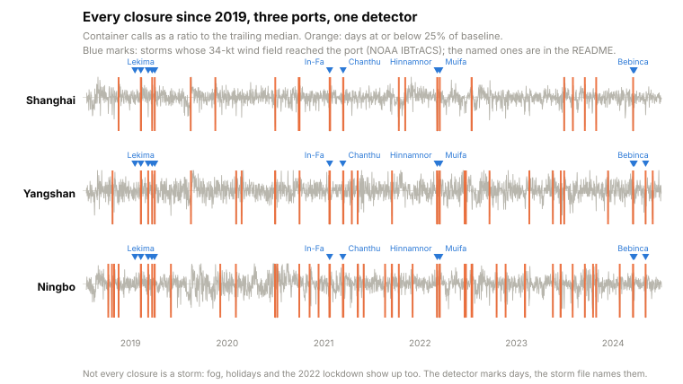

# port-queue

**The typhoon closed the port for two days. The queue lasted a week.**

[](https://github.com/rikardotoro/port-queue/actions/workflows/ci.yml)

When a storm closes a port, the delay everyone books is the closure. But a closed port keeps receiving ships, and when it reopens it has to serve the backlog *and* the ships still arriving. It can only work the backlog off at the difference between its capacity and its arrival rate. A busy port has very little of that difference, so a short closure turns into a long queue.

This tool measures a port's arrival rate and capacity from its own daily call history, finds the storm closures in that history, simulates the port as a queue with the closure injected, and then checks the simulated surge against what the port actually did afterwards. The demo is real: Shanghai, Typhoon Hinnamnor, September 2022, from IMF PortWatch and NOAA storm tracks.

<picture>
  <source media="(prefers-color-scheme: dark)" srcset="docs/charts/surge-dark.svg">
  
</picture>

## The thirty-second version

```
uvx --from git+https://github.com/rikardotoro/port-queue port-queue --demo
```

<!-- BEGIN OUTPUT -->
```
port-queue — Shanghai, closed 2022-09-04 → 2022-09-05 (2 days)  ·  typhoon Hinnamnor
Before the storm: 34.5 ships/day arriving, 40.0/day capacity → utilisation 86%.

The closure is 2 days. The queue is not.
  Closed form: 12.5 days to clear (every closure day costs 6.3 queue days at 86%).
  Simulated, ships keep arriving: 11.4 days (P90 14, 200 runs).

Checked against the port
  88 ship-calls went missing around the closure; 50 came back as a surge within 14 days → recovered 57%.
  Calibrated (only 57% keep coming): 6.1 days to clear, longest wait 1.9 days, fit 0.36 vs textbook 0.42 (RMSE of the ratio to baseline).
day  real  textbook  calibrated
-1   0.43      1.00        0.60
+0   0.00      0.00        0.00
+1   0.00      0.00        0.00
+2   1.10      1.16        1.16
+3   1.22      1.16        1.16
+4   1.19      1.16        1.16
+5   1.22      1.16        1.14
+6   0.99      1.16        1.12
+7   1.10      1.16        1.10
+8   1.16      1.16        1.08

What if the same storm came back 4 days later
  Queue after the second storm: 7.5 days to clear (one storm: 6.1).
  Ships: 276 ship-days waiting vs 162 for one storm — ×1.7, less than two separate storms; longest wait 2.2 vs 1.9 days.

What if the port had 10% more capacity
  Same storm: 3.6 days to clear, 70 ship-days waiting vs 125.

The storm is the closure. The cost is the queue.
```
<!-- END OUTPUT -->

## Why the queue outlives the storm

Call the arrival rate λ ships per day and the capacity μ ships per day. Utilisation is ρ = λ ÷ μ. While the port is closed for T days, λ·T ships pile up outside. When it reopens, the port serves μ a day but λ new ones keep arriving, so the pile shrinks by only μ − λ a day. Time to clear:

> T × λ ÷ (μ − λ) = T × ρ ÷ (1 − ρ)

At 60% utilisation a closed day costs a day and a half of queue. At 80% it costs four. At 90% it costs nine. Shanghai before Hinnamnor was running at 86%: 34.5 container ships a day against a demonstrated capacity of 40, so every closed day was worth six days of queue.

<picture>
  <source media="(prefers-color-scheme: dark)" srcset="docs/charts/multiplier-dark.svg">
  
</picture>

The dots are the simulation and the line is the formula. They agree, and a simulation has to pass that check before it can say anything the formula can't.

## Where the spreadsheet stops

The formula assumes ships arrive like clockwork. They don't, and at high utilisation randomness alone produces a queue before any storm. The simulation is a [SimPy](https://simpy.readthedocs.io/) model: ships arrive as a Poisson process at the measured rate, a set of berths serves them at the measured capacity, and a gate stops berthing on the closure days. It records the queue at anchor day by day, the wait of every ship, and how many ships berth each day, which is the thing PortWatch actually observes.

The formula gives one number; the simulation gives a spread. With every ship kept coming, the queue clears in 11 days on average and in 14 on a bad run. The shaded band in the hero chart is the 90th percentile of 200 runs.

It also handles storms that interact. A second closure a few days after the first lands on a port that is still draining, and whether that is worse than two separate storms depends on the gap:

<picture>
  <source media="(prefers-color-scheme: dark)" srcset="docs/charts/double-dark.svg">
  
</picture>

Back to back, the second storm nearly doubles the ship-days lost. From three days apart it costs less than two separate storms, because ships stop arriving the day before a typhoon and that lull drains the queue the first storm left. The queue after the second storm clears in seven and a half days instead of six, so the calendar hardly moves; the waiting time per ship is what changes.

## Checked against the port

PortWatch records a closure as zero container calls and the recovery as calls above baseline in the days after. So the tool overlays its simulated berthings on the real calls, ratio to the trailing median, and reports the fit.

The first version of the model was wrong. The textbook queue assumes every ship keeps coming during the closure and waits. The real surge after Hinnamnor was smaller than that: about 88 ship-calls went missing around the closure and about 50 came back within two weeks. The rest slowed down, diverted to Ningbo or Yangshan, or simply arrived later than the window can see. The tool measures that recovered fraction from the port's own history, feeds it back as the share of ships that keep arriving, and the calibrated model fits the surge better than the textbook one. Its queue after Hinnamnor clears in about six days, not eleven.

The simulation produced a number the port could contradict, and the port did. That is what the check is for.

## Every closure since 2019

The closure detector needs nothing but the calls: any day at or below a quarter of the trailing median. Run over three ports and six years it finds every named typhoon and a fair number of things that are not typhoons.

<picture>
  <source media="(prefers-color-scheme: dark)" srcset="docs/charts/atlas-dark.svg">
  
</picture>

A second, independent detector reads the NOAA best tracks and marks every storm whose 34-knot wind field reached the port. The two agree on In-Fa, Chanthu, Hinnamnor, Muifa and Bebinca to the day, and a test asserts it.

## Do this in your own tools

The closed form is a spreadsheet:

- Excel: `rho = MEDIAN(calls) / PERCENTILE.INC(calls, 0.98)` over the year before the storm, then `= closure_days * rho / (1 - rho)`. Multiply by the recovered fraction if you have measured one.
- SQL: `PERCENTILE_CONT(0.5)` and `PERCENTILE_CONT(0.98) WITHIN GROUP (ORDER BY calls)` over the same window; the arithmetic is the same.
- DAX: `MEDIANX` and `PERCENTILEX.INC` on the daily calls table.

The spreadsheet stops there. Random arrivals, the shape of the surge, the spread of clearing times and the second storm need the simulation. The whole model is about 150 lines of SimPy in [`sim.py`](src/port_queue/sim.py).

## Five ways to get this wrong

1. **Booking the closure as the delay.** Whenever utilisation is above 50%, the queue lasts longer than the closure. [`test_multiplier_exceeds_one_when_busy`](tests/test_sim.py)
2. **Trusting a simulation you can't check.** With clockwork arrivals the simulation must reproduce T × ρ ÷ (1 − ρ) to the day, and with no storm it must produce no queue. [`test_deterministic_closure_reproduces_the_closed_form`](tests/test_sim.py), [`test_no_closure_means_no_queue`](tests/test_sim.py)
3. **Losing ships.** The simulated surge after the closure must equal the ships that arrived during it. [`test_simulated_surge_conserves_the_ships_that_arrived`](tests/test_sim.py)
4. **Assuming the textbook.** Only part of the backlog comes back as a surge; the calibrated model must fit the port better than the textbook one. [`test_hinnamnor_only_half_the_ships_came_back`](tests/test_validate.py), [`test_calibrated_model_fits_the_port_better_than_the_textbook`](tests/test_validate.py)
5. **Estimating capacity from the average.** Set capacity to the mean and utilisation is 100%: the queue never clears. The tool refuses with *"at that capacity your port is not congested, it is closed."* [`test_utilisation_refuses_a_saturated_port`](tests/test_rates.py)

## Run it

```
port-queue --data calls.csv [--port shanghai] [--event 2022-09-04 | --closures 2022-09-04,2022-09-05]
           [--storms storms.csv] [--capacity-quantile 0.98] [--runs 200] [--seed 0]
           [--second-storm-after 4] [--map calls=my_column] [--json]
```

The CSV needs a date column and a daily calls column; `portcalls_container`, `arrivals`, `vessels` and `ships` are recognised, anything else maps with `--map`. Give `--event` any date inside the closure you want, or `--closures` to name the days yourself. `--storms` takes the IBTrACS hits file from [`scripts/fetch_ibtracs.py`](scripts/fetch_ibtracs.py) so the report can name the storm. Capacity is the 98th percentile of the prior year's daily calls by default; the README's multiplier chart tells you how much that choice matters.

## What this doesn't do

- It does not forecast storms or their likelihood. It replays closures that happened.
- It is one port. Ships that divert to a neighbour are lost to this model, which is exactly what the recovered fraction measures.
- A PortWatch "call" is a ship seen arriving by AIS, not a terminal record. Capacity is what the port demonstrably reached, not what it is rated for.
- The storm detector reads wind radii; fog, strikes and lockdowns close ports too and show up in the atlas without a name.
- The data is real and nothing is synthetic; see [`SOURCE.md`](src/port_queue/examples/SOURCE.md).

## Is any of this actually tested?

<details>
<summary>Yes. The list below is generated by running the suite.</summary>

<!-- BEGIN TESTS -->
```
39 passed

tests/test_cli.py::test_demo_runs_and_tells_the_story PASSED
tests/test_cli.py::test_json_has_the_numbers PASSED
tests/test_cli.py::test_explicit_closures_are_honoured PASSED
tests/test_cli.py::test_saturated_port_is_refused_with_the_joke PASSED
tests/test_cli.py::test_unknown_event_names_the_nearest_closure PASSED
tests/test_data.py::test_canonical_columns PASSED
tests/test_data.py::test_portwatch_aliases_are_detected PASSED
tests/test_data.py::test_missing_days_become_nan_not_zero PASSED
tests/test_data.py::test_missing_calls_column_names_the_options PASSED
tests/test_data.py::test_bad_value_names_the_row PASSED
tests/test_data.py::test_port_filter_on_multi_port_file PASSED
tests/test_data.py::test_demo_file_loads_daily PASSED
tests/test_demo_data.py::test_three_ports_have_six_years_of_days PASSED
tests/test_demo_data.py::test_examples_stay_small PASSED
tests/test_demo_data.py::test_storms_include_the_named_typhoons PASSED
tests/test_detect.py::test_adjacent_dead_days_merge_into_one_closure PASSED
tests/test_detect.py::test_shanghai_calls_reveal_the_named_typhoons PASSED
tests/test_detect.py::test_tracks_give_muifa_at_shanghai PASSED
tests/test_detect.py::test_both_detectors_agree_within_a_day PASSED
tests/test_detect.py::test_closure_is_a_value_object PASSED
tests/test_rates.py::test_arrival_rate_is_the_trailing_median_before_the_day PASSED
tests/test_rates.py::test_arrival_rate_skips_closure_days PASSED
tests/test_rates.py::test_capacity_is_a_high_quantile_of_the_prior_year PASSED
tests/test_rates.py::test_utilisation_refuses_a_saturated_port PASSED
tests/test_rates.py::test_too_little_history_is_refused PASSED
tests/test_rates.py::test_shanghai_before_muifa_is_a_busy_but_not_saturated_port PASSED
tests/test_sim.py::test_closed_form_multiplier PASSED
tests/test_sim.py::test_no_closure_means_no_queue PASSED
tests/test_sim.py::test_deterministic_closure_reproduces_the_closed_form PASSED
tests/test_sim.py::test_multiplier_exceeds_one_when_busy PASSED
tests/test_sim.py::test_poisson_mode_is_seeded_and_reproducible PASSED
tests/test_sim.py::test_second_storm_inside_the_drain_window_hurts_ships_not_the_calendar PASSED
tests/test_sim.py::test_run_many_summarises_the_runs PASSED
tests/test_sim.py::test_arrival_factor_scales_the_backlog_and_the_drain PASSED
tests/test_sim.py::test_simulated_surge_conserves_the_ships_that_arrived PASSED
tests/test_smoke.py::test_version_is_exposed PASSED
tests/test_smoke.py::test_saturated_port_error_is_a_port_queue_error PASSED
tests/test_validate.py::test_hinnamnor_only_half_the_ships_came_back PASSED
tests/test_validate.py::test_calibrated_model_fits_the_port_better_than_the_textbook PASSED
```
<!-- END TESTS -->

</details>

MIT. Part of a series of small freight analytics tools.
